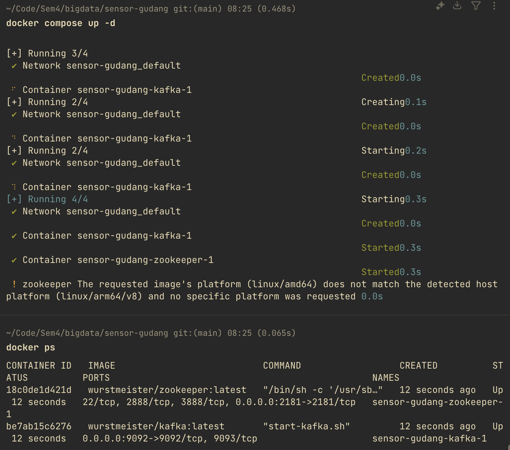
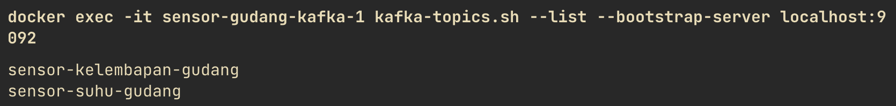
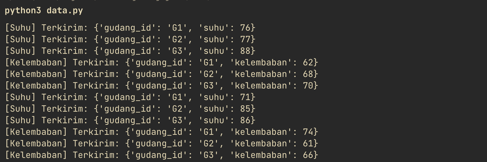
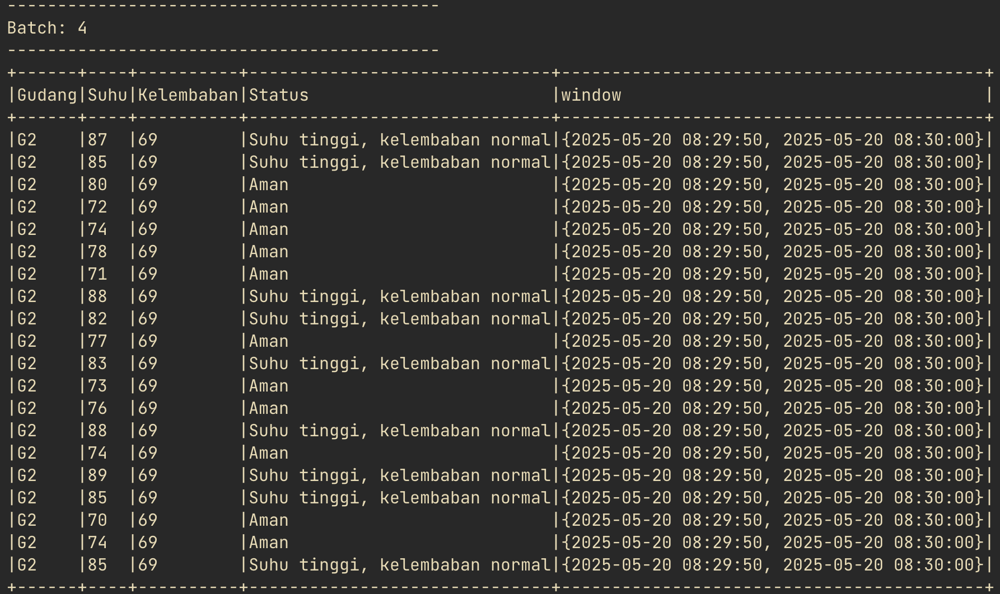
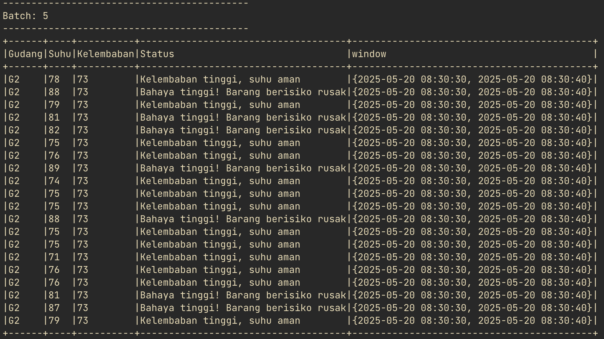

# Monitoring Real-Time Warehouse Conditions with Apache Kafka & PySpark

A streaming analytics project to monitor temperature and humidity across multiple warehouses in real‑time. Utilizes Dockerized Apache Kafka for ingestion, a Python-based producer for sensor simulation, and PySpark Structured Streaming for processing and alert generation.

---

## 📖 Overview

Perusahaan logistik membutuhkan pemantauan **suhu** dan **kelembaban** di gudang yang menyimpan barang sensitif (makanan, obat‑obatan, elektronik). Proyek ini:

- Mensimulasikan data sensor secara real‑time via Python producer (`data.py`).
- Menyajikan data ke topik Kafka: `sensor-suhu-gudang` & `sensor-kelembapan-gudang`.
- Memproses stream di PySpark (`consumer.py`), menggabungkan windowed streams, dan menghasilkan status:

  1. **Aman**
  2. **Suhu tinggi, kelembaban normal**
  3. **Kelembaban tinggi, suhu aman**
  4. **Bahaya tinggi! Barang berisiko rusak**

---

## 🚀 Architecture & Data Flow

1.  **`data.py`**:

    - Bertanggung jawab untuk menghasilkan data sensor suhu dan kelembapan.
    - Data diformat dalam format JSON.
    - Data dikirimkan melalui Kafka ke dua topik yang berbeda: `sensor-suhu-gudang` dan `sensor-kelembapan-gudang`.

2.  **`Kafka`**:

    - Berfungsi sebagai message broker yang menerima data dari `data.py`.
    - Memisahkan aliran data suhu dan kelembapan ke topik masing-masing.

3.  **`consumer.py` (PySpark)**:
    - Aplikasi PySpark yang bertindak sebagai _consumer_ untuk topik Kafka `sensor-suhu-gudang` dan `sensor-kelembapan-gudang`.
    - **Pemrosesan Suhu**:
      - Membaca data suhu dari topik `sensor-suhu-gudang`.
      - Melakukan parsing data JSON untuk mendapatkan nilai suhu dan informasi terkait (misalnya, ID gudang, timestamp).
      - Menambahkan _watermark_ untuk menangani data yang datang terlambat (late data).
      - Menerapkan _windowing_ (misalnya, sliding window atau tumbling window) untuk mengelompokkan data suhu dalam interval waktu tertentu.
    - **Pemrosesan Kelembapan**:
      - Membaca data kelembapan dari topik `sensor-kelembapan-gudang`.
      - Melakukan parsing data JSON untuk mendapatkan nilai kelembapan dan informasi terkait.
      - Menambahkan _watermark_ untuk menangani late data.
      - Menerapkan _windowing_ dengan durasi yang sama dengan windowing pada data suhu.
    - **`full_outer join`**:
      - Menggabungkan (join) hasil pemrosesan data suhu dan kelembapan berdasarkan ID gudang (`warehouse`) dan interval waktu (`window`).
      - Menggunakan `full_outer join` memastikan bahwa semua data suhu dan kelembapan dalam window yang sama akan dipertimbangkan, meskipun salah satu jenis sensor mungkin tidak mengirimkan data pada interval waktu tertentu.
    - **Penentuan `Status`**:
      - Setelah data suhu dan kelembapan berhasil digabungkan untuk setiap gudang dan window, logika bisnis diterapkan untuk menentukan `Status`.
      - Kondisi penentuan status dapat melibatkan rentang nilai suhu dan kelembapan yang dianggap ideal, terlalu tinggi, atau terlalu rendah.
    - **Output ke Console**:
      - Hasil akhir yang berisi informasi gudang, window waktu, suhu, kelembapan, dan `Status` ditampilkan ke console secara berkala (setiap 5 detik dalam kasus ini).

## 📋 File & Fungsionalitas

### 1. `docker-compose.yml`

define dua service: Zookeeper & Kafka (wurstmeister).

- **`Apache Zookeeper`** adalah layanan koordinasi yang digunakan Kafka untuk mengelola cluster state, termasuk:

  - Menyimpan metadata broker & topik
  - Mengatur pemilihan controller broker
  - Menjaga konsistensi & sinkronisasi antar node

📌 Mengapa dipakai: Kafka versi lama (termasuk wurstmeister) butuh Zookeeper agar bisa berfungsi sebagai sistem terdistribusi yang stabil.

- **`Apache Kafka`** adalah sistem message broker yang mampu menangani data streaming secara real-time.

  - Menerima, menyimpan, dan mendistribusikan pesan (misal: data sensor)
  - Dapat di-scale dan bekerja dalam real-time pipeline

📌 Mengapa dipakai: Kafka memungkinkan simulasi dan konsumsi data sensor suhu & kelembaban secara paralel, cepat, dan andal.

```yml
services:
  zookeeper:
    image: wurstmeister/zookeeper:latest
    ports:
      - "2181:2181"

  kafka:
    image: wurstmeister/kafka:latest
    ports:
      - "9092:9092"
    expose:
      - "9093"
    environment:
      KAFKA_ADVERTISED_LISTENERS: INSIDE://kafka:9093,OUTSIDE://localhost:9092
      KAFKA_LISTENER_SECURITY_PROTOCOL_MAP: INSIDE:PLAINTEXT,OUTSIDE:PLAINTEXT
      KAFKA_LISTENERS: INSIDE://0.0.0.0:9093,OUTSIDE://0.0.0.0:9092
      KAFKA_INTER_BROKER_LISTENER_NAME: INSIDE
      KAFKA_ZOOKEEPER_CONNECT: zookeeper:2181
      KAFKA_CREATE_TOPICS: sensor-suhu-gudang:1:1,sensor-kelembapan-gudang:1:1
    volumes:
      - /var/run/docker.sock:/var/run/docker.sock
```

### 2. `data.py` (Producer)

Mensimulasikan dua thread: suhu & kelembaban. Setiap detik, kirim data JSON ke Kafka:

```python
from kafka import KafkaProducer
import json
import time
import random
import threading

producer = KafkaProducer(
    bootstrap_servers='localhost:9092',
    value_serializer=lambda v: json.dumps(v).encode('utf-8')
)

gudang_id = ['G1', 'G2', 'G3']

def kirim_suhu():
    while True:
        for gid in gudang_id:
            suhu = random.randint(70, 90)
            data = {"gudang_id": gid, "suhu": suhu}
            producer.send('sensor-suhu-gudang', value=data)
            print(f"[Suhu] Terkirim: {data}")
        time.sleep(1)

def kirim_kelembaban():
    while True:
        for gid in gudang_id:
            kelembaban = random.randint(60, 80)
            data = {"gudang_id": gid, "kelembaban": kelembaban}
            producer.send('sensor-kelembapan-gudang', value=data)
            print(f"[Kelembaban] Terkirim: {data}")
        time.sleep(1)

# Buat thread untuk masing-masing jenis data
threading.Thread(target=kirim_suhu).start()
threading.Thread(target=kirim_kelembaban).start()
```

### 3. `consumer.py` (PySpark Streaming)

```python
from pyspark.sql import SparkSession
from pyspark.sql.functions import (
    from_json, col, expr, window, when, lit, coalesce
)
from pyspark.sql.types import StructType, StringType, IntegerType

spark = SparkSession.builder \
    .appName("MonitoringGudang") \
    .config(
        "spark.jars.packages",
        "org.apache.spark:spark-sql-kafka-0-10_2.12:3.4.1"
    ) \
    .getOrCreate()

spark.sparkContext.setLogLevel("ERROR")

# 1) Definisi schema
schema_suhu = StructType().add("gudang_id", StringType()).add("suhu", IntegerType())
schema_kelembaban = StructType().add("gudang_id", StringType()).add("kelembaban", IntegerType())

# 2) Baca & parse stream suhu
suhu_df = (
    spark.readStream
         .format("kafka")
         .option("kafka.bootstrap.servers", "localhost:9092")
         .option("subscribe", "sensor-suhu-gudang")
         .load()
)

suhu_stream = (
    suhu_df
    .selectExpr("CAST(value AS STRING) AS json")
    .select(from_json("json", schema_suhu).alias("d"))
    .select("d.gudang_id", "d.suhu", expr("current_timestamp() AS ts"))
    .withWatermark("ts", "15 seconds")
    .select("gudang_id", "suhu", window("ts", "10 seconds").alias("window"))
)

# 3) Baca & parse stream kelembaban
kelembaban_df = (
    spark.readStream
         .format("kafka")
         .option("kafka.bootstrap.servers", "localhost:9092")
         .option("subscribe", "sensor-kelembapan-gudang")
         .load()
)

kelembaban_stream = (
    kelembaban_df
    .selectExpr("CAST(value AS STRING) AS json")
    .select(from_json("json", schema_kelembaban).alias("d"))
    .select("d.gudang_id", "d.kelembaban", expr("current_timestamp() AS ts"))
    .withWatermark("ts", "15 seconds")
    .select("gudang_id", "kelembaban", window("ts", "10 seconds").alias("window"))
)

# 4) Full-outer join agar semua gudang muncul
report_stream = suhu_stream.join(
    kelembaban_stream,
    on=["gudang_id", "window"],
    how="full_outer"
)

# 5) Tentukan status berdasarkan kombinasi suhu & kelembaban
status_stream = report_stream.select(
    col("gudang_id").alias("Gudang"),
    coalesce(col("suhu"), lit(0)).alias("Suhu"),
    coalesce(col("kelembaban"), lit(0)).alias("Kelembaban"),
    when(
        (col("Suhu") > 80) & (col("Kelembaban") > 70),
        lit("Bahaya tinggi! Barang berisiko rusak")
    ).when(
        (col("Suhu") > 80) & (col("Kelembaban") <= 70),
        lit("Suhu tinggi, kelembaban normal")
    ).when(
        (col("Suhu") <= 80) & (col("Kelembaban") > 70),
        lit("Kelembaban tinggi, suhu aman")
    ).otherwise(
        lit("Aman")
    ).alias("Status"),
    "window"
)

# 6) Tulis hasil ke console setiap 5 detik
query = status_stream.writeStream \
    .outputMode("append") \
    .format("console") \
    .option("truncate", False) \
    .trigger(processingTime="5 seconds") \
    .start()

query.awaitTermination()
```

## 🎯 Getting Started

1. **Start services**

```bash
docker-compose up -d
```

then

```bash
docker ps
```



2. **Verify topics**

```bash
docker exec -it sensor-gudang-kafka-1 kafka-topics.sh --list --bootstrap-server localhost:9092
```



3. **Run producer**

```bash
python3 data.py
```



4. **Run consumer**

```bash
python3 consumer.py
```



